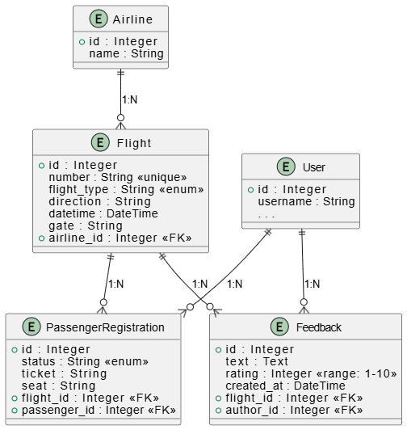

# Лабораторная 2. Реализация простого сайта средствами django
## Условие
Вариант 3: Табло отображения информации об авиаперелетах.

Хранится информация о номере рейса, авиакомпании, отлете, прилете, типе
(прилет, отлет), номере гейта.
Необходимо реализовать следующий функционал:

- Регистрация новых пользователей.
- Просмотр и резервирование мест на рейсах. Пользователь должен иметь
возможность редактирования и удаления своих резервирований.
- Администратор должен иметь возможность зарегистрировать на рейс
пассажира и вписать в систему номер его билета средствами Django-admin.
- В клиентской части должна формироваться таблица, отображающая всех
пассажиров рейса.
- Написание отзывов к рейсам. При добавлении комментариев, должны
сохраняться дата рейса, текст комментария, рейтинг (1-10), информация о
комментаторе.
## Выполнение
### Модели

### API

### App users

`POST /users/register/` - Регистрация пользователя

**Тело запроса:**  
- `username`: Имя пользователя.
- `password`: Пароль.

---

`POST /users/login/` - Аутентифицирует существующего пользователя.

**Тело запроса:**  
- `username`: Имя пользователя.
- `password`: Пароль.

---

`POST /users/logout/` - Завершает сессию пользователя.

### App flights

`GET /flights/?page=&q=` - Возвращает список рейсов.

Реализована пагинация и поиск по следующим полям Flight:
- number
- direction
- airline.name
---

`GET /flights/<int:pk>` - Возвращает детальную информацию о конкретном рейсе.  

Детальная информация о рейсе, Возможность резервировать место для авторизованных пользователей, просмотр мест пассажиров на этот рейс (включая резервации), Возможность оставить фидбек (только для авторизованных пользователей, которые были зарегистрированы на рейс), и посмотреть фидбеки на этот рейс 

---

`POST /flights/<int:flight_id>/reserve-seat` - Позволяет авторизованному пользователю забронировать место на конкретный рейс.

**Тело запроса:**  
- Форма с информацией о месте.

Возвращает ошибку, если место уже занято или пользователь не авторизован. Если все хорошо, перенапрявляет на страницу рейса с обновленной информацией.

---

`GET /flights/my-registrations` - Показывает список всех рейсов, на которые авторизованный пользователь забронировал или зарегистрировал место.

---

`POST /flights/<int:flight_id>/delete-registration` - Позволяет авторизованному пользователю удалить свою бронь на конкретный рейс.  

---

`POST /flights/<int:flight_id>/leave-feedback` - Позволяет авторизованному пользователю оставить отзыв и оценку для завершенного рейса.  

**Тело запроса:**  
- `text`: Текст отзыва (опционально).
- `rating`: Числовая оценка (обязательно, от 1 до 10).  

**Ответ:**  
Перенаправляет на страницу деталей рейса с добавленным отзывом.

---